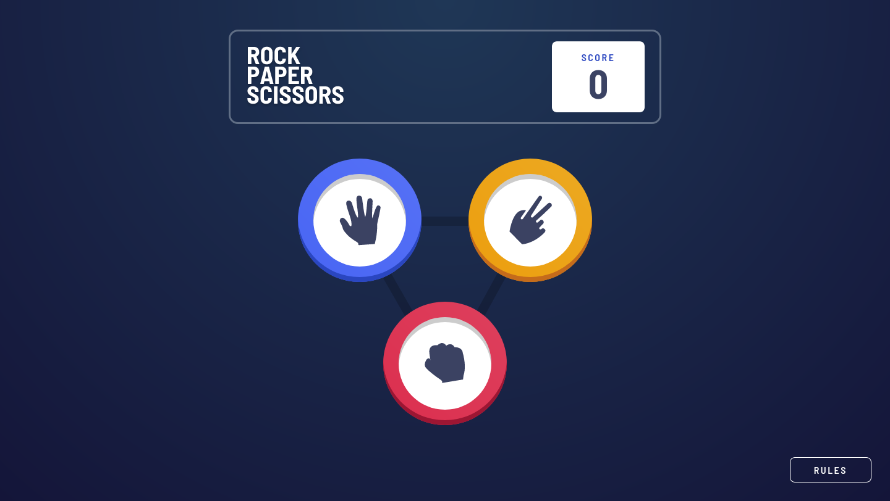

# 🎮 Rock-paper-scissors Game



## 📄 Descrição

Este projeto é uma solução para o desafio Rock-paper-scissors Game do site Frontend Mentor :D

É um simples jogo de Pedra, Papel e Tesoura implementado utilizando HTML, CSS e JavaScript. Permite que os jogadores joguem contra o computador e mantém o controle do placar.

Link da projeto: https://grazziotti.github.io/rock-paper-scissors-game/

## 🛠 Tecnologias Utilizadas

- HTML5
- CSS3
- JavaScript

## 📋 Pré-requisitos

Antes de começar, você vai precisar ter instalado em sua máquina as seguintes ferramentas: [Git](https://git-scm.com/).

Além disto é bom ter um editor para trabalhar com o código como [VSCode](https://code.visualstudio.com/).

## 🚀 Como Executar

```bash
# Clone este repositório
$ git clone https://github.com/grazziotti/rock-paper-scissors-game

# Navegue até o diretório do projeto.

# Execute o projeto
Abra o arquivo index.html no seu navegador.
```

## 👤 Autor


[Daniel Grazziotti](https://github.com/grazziotti)
